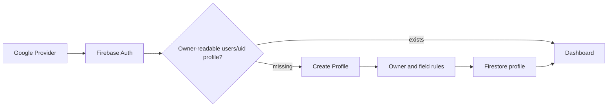
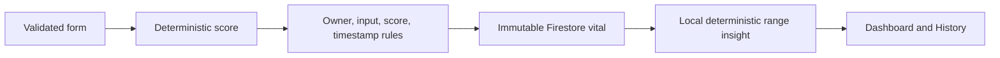

# CareAI Data Flow

**Status:** Active  
**Version:** 1.1
**Last Updated:** 2026-08-15
**Related:** [Authentication](../03-auth/authentication.md), [Firestore Queries](../09-database/firestore-queries.md)

## Auth and profile — implemented in code, not deployed

The browser observes Firebase Auth and loads/saves only `users/{currentUid}`. Firestore rules require the authenticated UID, permitted fields, validation ranges, and server timestamps.

## Vital and insight — implemented in code, not deployed

The idempotency key is the immutable reading document ID. Rules recompute the documented deviation/emergency score result and reject forged scores or out-of-limit readings. No OpenRouter request or analysis document is created in Spark mode.

## Dashboard/history

The authenticated UID scopes bounded newest-first direct Firestore queries. History filters use `createdAt`, and pagination uses `createdAt` plus document ID. The public landing page remains a separate static-demo flow.
