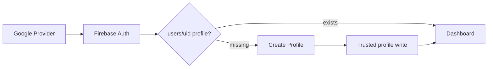
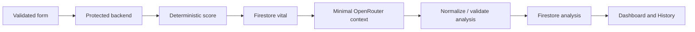

# CareAI Data Flow

**Status:** Active  
**Version:** 1.0  
**Last Updated:** 2026-08-10
**Related:** [Authentication](../03-auth/authentication.md), [Firestore Queries](../09-database/firestore-queries.md)

## Auth and profile — implemented in code, not deployed

Current code observes Firebase Auth, loads/saves profiles through the verified backend, and requires `profileCompleted: true` before protected routes unlock.

## Vital and AI — implemented in code, not deployed

Current code submits five readings with a Firebase ID token and idempotency key. The backend validates, scores, persists the reading, calls/normalizes OpenRouter, and persists a separate linked analysis; provider failure preserves the reading and safe fallback state.

## Dashboard/history — target

The authenticated UID scopes latest/recent/trend readings and linked analysis. The public landing page is a separate flow using static demo data only.
