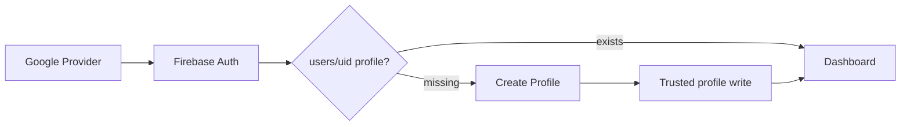
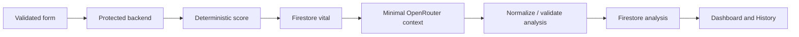

# CareAI Data Flow

**Status:** Active  
**Version:** 1.0  
**Last Updated:** 2026-08-08  
**Related:** [Authentication](../03-auth/authentication.md), [Firestore Queries](../09-database/firestore-queries.md)

## Auth and profile — target

Current state: mock user and profile are read from localStorage.

## Vital and AI — target

Current state: `createVital()` adds an ISO timestamp, calls `analyzeVitals()` locally, and writes one combined record to `aicare.vitals.v1`.

## Dashboard/history — target

The authenticated UID scopes latest/recent/trend readings and linked analysis. The public landing page is a separate flow using static demo data only.
