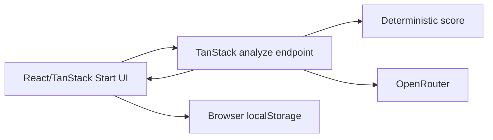
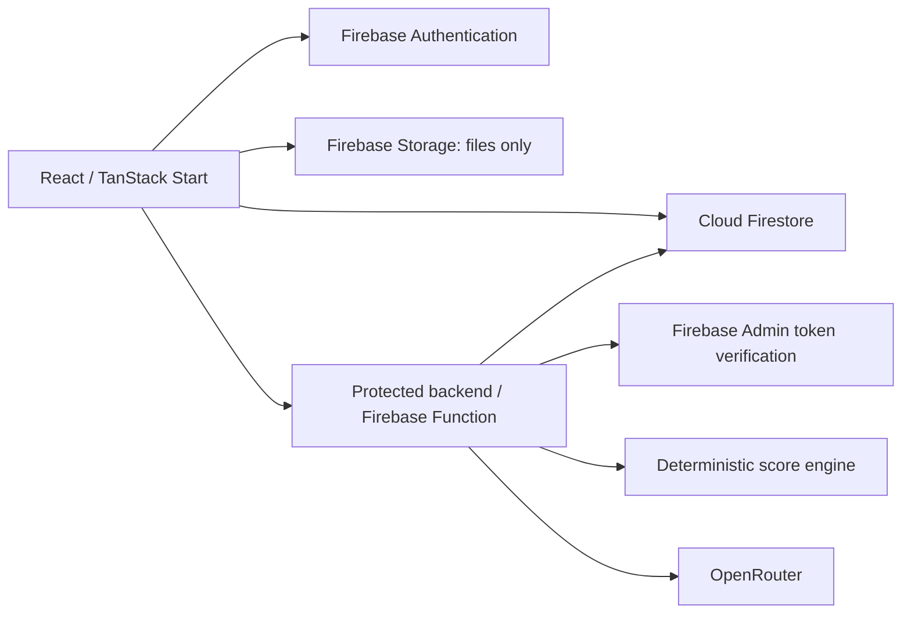

# CareAI System Architecture

**Status:** Active  
**Version:** 1.0  
**Last Updated:** 2026-08-10
**Related:** [Frontend](./frontend-architecture.md), [Backend](./backend-architecture.md), [Security](../10-security/security.md)

## Current architecture — PARTIAL

The repository is a single TanStack Start application. Mock identity, profile state, and final vital persistence remain in browser localStorage. Vital submission now passes through a TanStack server endpoint for repeat validation, deterministic score execution, and optional normalized OpenRouter analysis before the returned record is saved locally.

## Target MVP architecture — PLANNED

Responsibilities: UI captures/presents data; Firebase Auth establishes identity; Firestore stores structured owner-scoped records; Storage stores files only; the protected backend validates requests, derives the UID, scores vitals, calls OpenRouter, normalizes output, and performs trusted writes. Trusted business and security logic must not live in browser code.

## Gap

Firebase dependencies/configuration, Admin SDK verification, Firestore persistence/rules, and Storage rules remain absent. OpenRouter configuration and server validation exist only in the local TanStack server slice. The missing identity and durable ownership boundary remains a P0 production-readiness gap.
