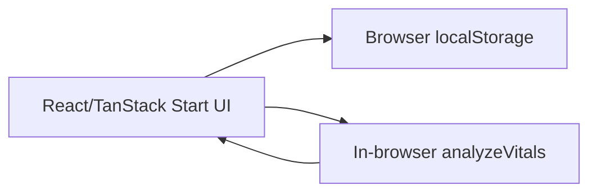
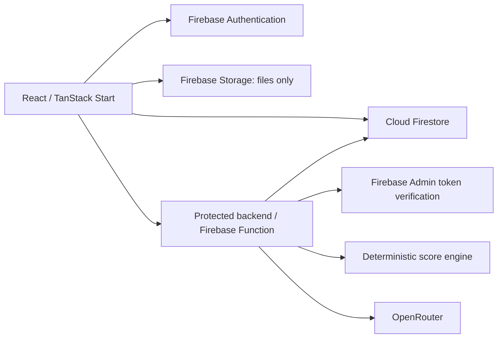

# CareAI System Architecture

**Status:** Active  
**Version:** 1.0  
**Last Updated:** 2026-08-08  
**Related:** [Frontend](./frontend-architecture.md), [Backend](./backend-architecture.md), [Security](../10-security/security.md)

## Current architecture — PARTIAL

The repository is a single TanStack Start application. React UI, mock identity, profile state, vital persistence, score calculation, and rule-based insight all run in the browser. `src/server.ts` and `src/start.ts` provide framework serving and CSRF middleware for server functions, but no application API/server functions were found.

## Target MVP architecture — PLANNED

Responsibilities: UI captures/presents data; Firebase Auth establishes identity; Firestore stores structured owner-scoped records; Storage stores files only; the protected backend validates requests, derives the UID, scores vitals, calls OpenRouter, normalizes output, and performs trusted writes. Trusted business and security logic must not live in browser code.

## Gap

Firebase dependencies/configuration, functions/API, Admin SDK, Firestore rules, Storage rules, OpenRouter configuration, and server validation are absent. This is a P0 production-readiness gap.
