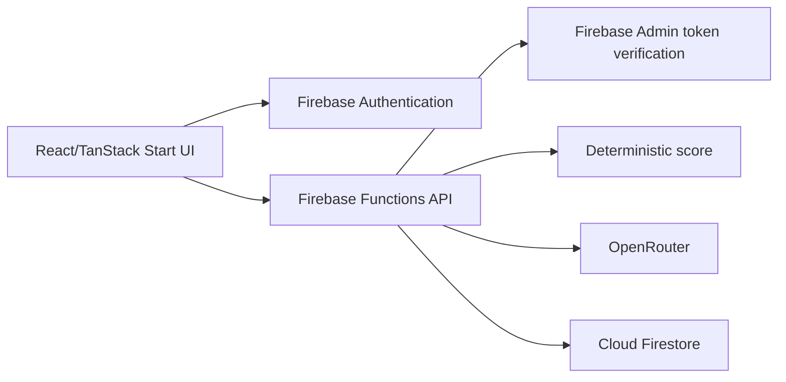
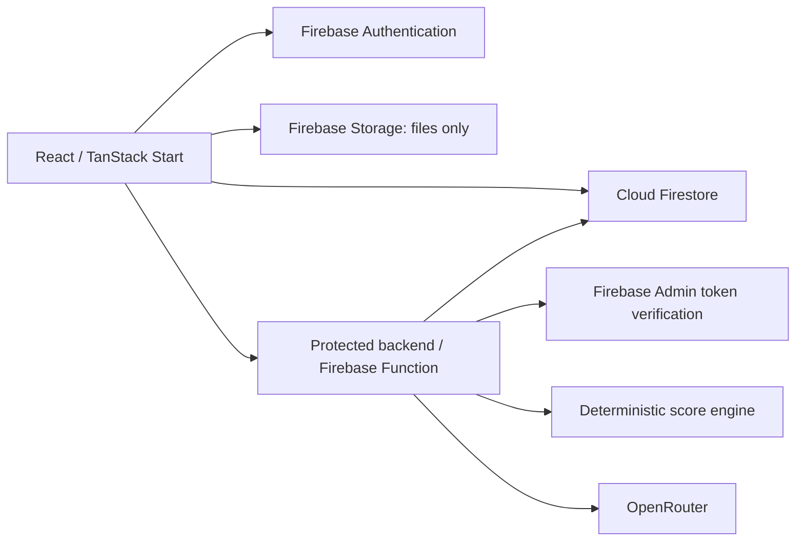

# CareAI System Architecture

**Status:** Active  
**Version:** 1.0  
**Last Updated:** 2026-08-10
**Related:** [Frontend](./frontend-architecture.md), [Backend](./backend-architecture.md), [Security](../10-security/security.md)

## Current architecture — IMPLEMENTED IN CODE, NOT DEPLOYED

The repository contains a TanStack Start frontend plus a Firebase Cloud Functions backend. Firebase Authentication establishes identity; token-bearing API requests reach the regional Functions API; Firebase Admin verifies identity and performs owner-scoped Firestore reads/writes; and OpenRouter remains server-only. A one-time cutover clears legacy mock identity/profile/vital localStorage keys without importing them.

## Target MVP architecture

Responsibilities: UI captures/presents data; Firebase Auth establishes identity; Firestore stores structured owner-scoped records; Storage stores files only; the protected backend validates requests, derives the UID, scores vitals, calls OpenRouter, normalizes output, and performs trusted writes. Trusted business and security logic must not live in browser code.

## Remaining gap

Firebase project provisioning, Google-provider setup, deployed rules/indexes/functions, secret configuration, rules-emulator acceptance, and end-to-end verification remain outstanding. The repository implementation alone is not a production authorization boundary until those controls are deployed and verified.
