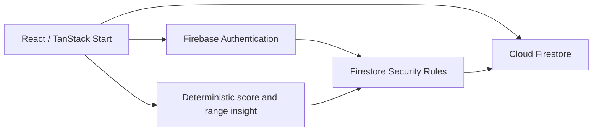

# CareAI System Architecture

**Status:** Active  
**Version:** 1.1
**Last Updated:** 2026-08-15
**Related:** [Frontend](./frontend-architecture.md), [Backend](./backend-architecture.md), [Security](../10-security/security.md)

## Current Spark architecture — FIRESTORE DEPLOYED, FRONTEND E2E PENDING

The active application uses Firebase Authentication and direct Cloud Firestore access from the React frontend. Every private path is rooted under the current Firebase user's UID. Security rules enforce owner access, exact profile/vital fields, technical vital limits, immutable readings, server timestamps, and the deterministic score/status/emergency result. A one-time cutover clears legacy mock localStorage data without importing it.

This architecture remains compatible with the Firebase Spark plan because it does not deploy Cloud Functions. The frontend never contains or calls OpenRouter with a secret. AI analysis is explicitly unavailable; the UI labels its local result as rule-based.

## Inactive backend

`backend/` contains the previously implemented Firebase Functions/Admin/OpenRouter path. It is retained as reference code for a future billing-enabled or separately hosted protected server, is absent from `firebase.json`, and is not called by the active frontend.

## Remaining gap

Firestore rules/indexes are deployed to the default database in `care-ai-4eb8d`, and the focused rules-emulator suite passes. Auth Google-provider/browser setup, frontend deployment of this branch, and end-to-end verification remain outstanding. Direct writes make deployed rule integrity a release-critical control.
